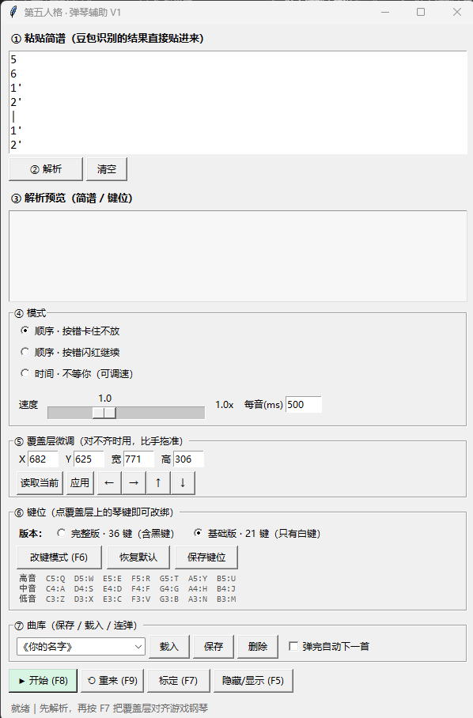
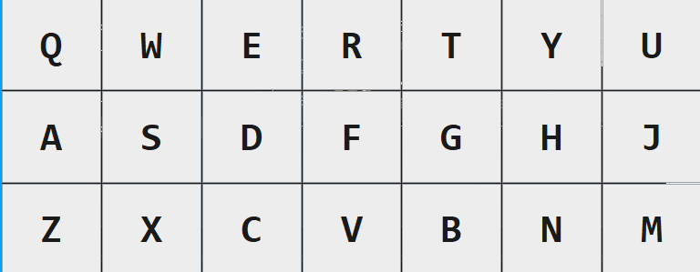

# Piano Assist

> **A practice assistant that won't play for you — it just shows you which key to press.**

Paste a numbered-notation score, and a translucent key-hint strip appears on screen:
**the key you should press lights up**. Press it right and it advances; press it wrong and it
can either block until you get it, or flash red and move on.

Game-specific differences live in **key presets**, so adapting to another game is just adding
a JSON file. Two presets for **Identity V** (第五人格) ship built in — a 36-key full layout and
a 21-key beginner layout — both tested on PC.

---

## 📸 Screenshots

**① Main window** — paste score → parse → pick mode → fine-tune overlay → remap keys → song library



**② The on-screen key hint strip** — translucent, sits on top of the in-game instrument,
**the key you should press lights up**

(Shown in 21-key beginner mode; the full layout is 3 rows × 12 keys with 5 extra black keys.)



---

## ✨ Highlights

### 🚫 No input simulation — hints only

This is the fundamental difference from "auto-play" tools:

| | Auto-play tools | **Piano Assist** |
|---|---|---|
| Simulate keystrokes | ✅ Plays for you | ❌ **Never** |
| Read your keyboard | — | ✅ Global hook (read-only) |
| Your role | Watch it play | **You play** |
| What improves | The result | **Your skill** |

**If you don't press anything, nothing happens.** It just removes the mental conversion step —
numbered notation says `1 2 3`, and you'd have to translate that into pitches and then hunt for
the keys. This tool simply lights up `A S D` for you.

### 🎯 Two modes: learn the song, then nail the timing

```
[Sequence mode] -- waits for you
   +- wrong key:  hold (strict)     <- learn it properly
   +- wrong key:  flash & continue  <- keep the flow
[Time mode]     -- doesn't wait, fixed tempo, adjustable speed
```

- **Sequence mode** (core): advances only when you play the right key — for **learning a song**
- **Time mode** (advanced): lights up on the beat and moves on — for **practicing timing** once you know the notes

### 🎹 Calibratable translucent overlay

- Translucent, click-through, always-on-top — never gets in your way
- **Follows the game window**: stores relative coordinates, so moving the window or changing
  resolution won't misalign it
- **Visual calibration**: hit a hotkey and drag/resize it onto the game's instrument
- Numeric fine-tuning panel for pixel-perfect alignment

### 🔧 Remappable keys, extensible presets

- **Click to remap**: enter remap mode → click a key on the overlay → press the new key
- Conflicts are **swapped automatically**, so one key never maps to two notes
- Layouts live in `presets/*.json` — **adding a layout is adding a JSON file**, no code changes

### 📚 Song library & continuous play

- Save scores to a library and load them with one click
- **Automatic title detection** (reads the `# Title` comment line)
- Tick "auto-next" and it plays through your library back to back

---

## 🚀 Quick start

### Requirements

- Windows 10 / 11
- Python 3.10+ (or [uv](https://github.com/astral-sh/uv))

### Run

```bash
# Option 1: plain python
pip install pynput
python main.py

# Option 2: uv (installs dependencies automatically)
uv run python main.py
```

On Windows you can also just double-click **`启动.bat`**, which requests administrator rights,
locates a Python environment, and pauses on errors.

> ⚠️ **Run as administrator** — many games launch elevated, and a non-elevated process may not
> receive your keystrokes.

### Three steps

```
1. Set the game to Windowed or Borderless, open the instrument UI
2. Run this tool -> press F7, drag the overlay onto the game's keys -> press F7 again to save
3. Paste your score -> click "解析" -> press F8 to start
```

> **Don't use exclusive fullscreen** — that's an OS-level display takeover, and no overlay can
> draw on top of it.

---

## ⌨️ Hotkeys

| Key | Action |
|---|---|
| `F5` | Show / hide the overlay |
| `F6` | Remap mode (click a key → press a new key) |
| `F7` | Calibration mode (drag / resize the overlay) |
| `F8` | Start / stop |
| `F9` | Restart |

Hotkeys are **global** — they work while the game is focused.

---

## 🎼 Where scores come from

### Score format

The tool reads **numbered-notation (jianpu) text**, one "moment" per line:

```
# 起风了        <- a leading # is the title; used automatically when saving
5
6
1'
|
5 1'           <- several notes on one line = press together (chord)
3
```

| Notation | Meaning |
|---|---|
| `1`–`7` | Scale degrees |
| `1'` / `1''` | One / two octaves up |
| `1,` / `1,,` | One / two octaves down |
| `3#` / `7b` | Sharp / flat |
| Space within a line | Press simultaneously (chord) |
| `\|` on its own line | Bar line |

### Transcribe images with AI

Most scores shared on social media are images. A vision LLM (Doubao, Qwen-VL, GPT-4o, …)
can convert them into the text above. **Getting the AI to emit a fixed format is the key to
reliability** — see 👉 [`docs/豆包提示词.md`](docs/豆包提示词.md) for ready-made prompts.

---

## 🎮 Adapting to another game

The core is game-agnostic: **jianpu parsing + a two-mode engine + a calibratable overlay**.
The only game-specific part is the note-to-key mapping.

To add a game:

1. Drop a JSON into `presets/` describing that instrument's key mapping
2. Restart the tool and pick the new preset in the "键位" section
3. Use F7 to align the overlay with that game's instrument

```json
{
  "id": "your-game-instrument",
  "name": "Some Game · Instrument",
  "game": "Some Game",
  "default": false,
  "cols": 12,
  "description": "Describe this layout",
  "map": { "60": "Z", "62": "X" }
}
```

- `map` keys are MIDI note numbers (C4 = 60); values are keyboard keys to press
- `cols` is how many columns the overlay draws per row

---

## 🗂 Project layout

```
piano-assist/
├── main.py              Main app: UI, hotkeys, event dispatch, library
├── overlay.py           Overlay: transparency/click-through/topmost, calibration, remap
├── engine.py            Two-mode engine: sequence (hold/flash) + time (fixed tempo)
├── score.py             Jianpu parser: chords, bar lines, octave dots, accidentals
├── keys.py              Preset manager: load, switch, remap, persist
├── library.py           Song library: save, load, title detection, auto-next
├── presets/             Key presets (one JSON = one layout)
├── docs/                Documentation
└── 启动.bat             Windows launcher
```

**Generated at runtime** (excluded via `.gitignore`):

| Path | Contents |
|---|---|
| `keymap.json` | Your remapped keys per preset |
| `calib.json` | Overlay calibration |
| `曲库/` | Your saved scores |

---

## 🙏 Credits

Ideas and key data were informed by these open-source projects:

- **[Chener-03/GenshinPiano](https://github.com/Chener-03/GenshinPiano)** — MIT
  First demonstrated the "translucent overlay + key hints + step-by-step playing" shape
  (for Genshin Impact). This project's sequence mode follows that idea, but **contains no
  driver-level input simulation**.
- **[Tsundeer/MeowField_AutoPiano](https://github.com/Tsundeer/MeowField_AutoPiano)** — GPL-3.0
  Identity V key mapping was cross-referenced against its instrument config.
- **[Nigh/DoMiSo-Universal](https://github.com/Nigh/DoMiSo-Universal)** — MIT
  An open-source auto-play implementation; key conventions corroborate each other.

---

## ⚠️ Disclaimer

- This is an **unofficial** tool, not affiliated with any game developer or publisher.
- It **does not simulate input, read or write game memory, or modify game files** — it only
  shows local key hints.
- Third-party assistive tools **may violate a game's terms of service**. **Any account risk is
  yours alone.**
- Please comply with the relevant game's terms of service and local laws.

---

## 📄 License

[GPL-3.0](LICENSE)

---

[简体中文](README.md) · English
